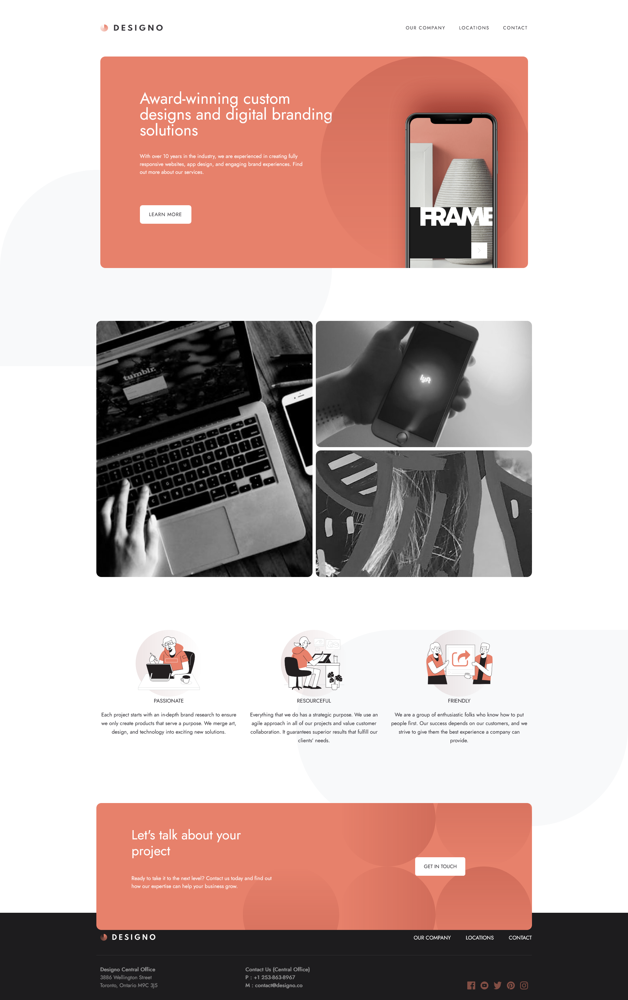
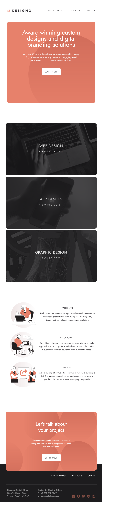
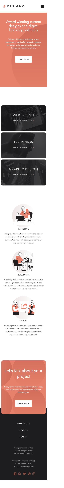

# Objective

Design a multi-pages website. 7 pages website that is responsive to tablet and mobile.

Follow along a Figma design.

**[Live Link](https://designo-multi-page-ochre.vercel.app/)**

# Technology

This is a React.js application.

Created the website using `create-react-app`

### <b>Run</b>

`yarn start`

### <b>Languages</b>
- JavaScript
- CSS
- HTML

### <b>Packages</b>
- sass
- react-bootstrap
- bootstrap
- react-router-dom

# Development Process
1) Determine what part can be broken down into reuseable components (components that will be used on another page).
2) Build the dekstop version of each individual pages.
    - Break a page into rows/sections.
    - Build the section or add the component onto the page.
3) Style pages for mobile and tablet.

# Screenshot

# Credit
Project provided by [Frontend Mentor](https://www.frontendmentor.io/challenges/designo-multipage-website-G48K6rfUT)